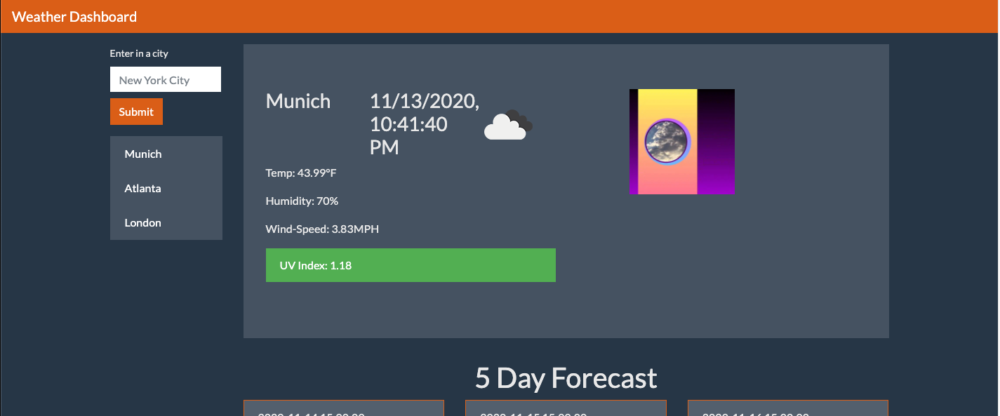

# weather_dashboard
A simple webapp that provides you with the current weather, and five day forecast for any city that you type into the search bar. Each city you type gets saved and you can access these cities in the search history, saving you the extra work of having to type a city name into the search bar everytime you want to see the weather for. 

For each city you will be able to see the current weather, which includes the following information. 
* City Name
* Date 
* An icon representation of the current weather conditions. 
* An associated gif that is based on the current temprature in that city. 
* Temprature
* Humidity 
* Wind Speed
* UV index that is color coded based on whether the UV is favorable, moderate, severe.

You will also be able to see the five day forecast for the city that you typed in. Each day in the five day forecast will have the following information. 
* Date
* An icon representation of the weather. 
* Temprature
* Humidity 

# Technologies Used 
1. Jquery 
2. Bootstrap
3. The Open weather data API 
4. GIPHY API

# Screenshot of Application

# Link to deployed website. 
* [Link to deployed site](https://v-lax.github.io/weather_dashboard/html/)

